# Platform Architecture

## System Architecture

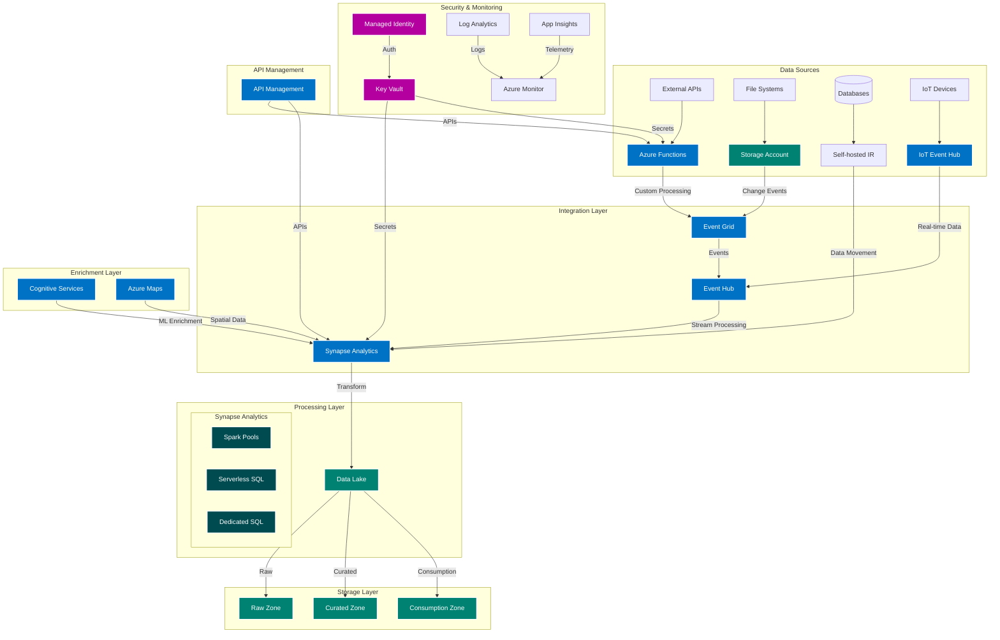

## Component Descriptions

### Integration Components
- **Azure Functions**: Event-driven compute for custom integrations
- **Event Grid**: Event routing and distribution
- **Event Hub**: Real-time data ingestion and stream processing
- **Self-hosted IR**: On-premises data integration runtime

### Processing Components
- **Synapse Analytics**:
  - Spark Pools: Distributed data processing
  - Serverless SQL: Ad-hoc analytics
  - Dedicated SQL: Performance-critical workloads

### Storage Components
- **Data Lake Zones**:
  - Raw: Original, unmodified data
  - Curated: Cleaned and transformed data
  - Consumption: Business-ready datasets

### Security Components
- **Key Vault**: Centralized secret management
- **Managed Identities**: Service authentication
- **Private Endpoints**: Network isolation

### Monitoring Components
- **Azure Monitor**: Unified monitoring
- **App Insights**: Application telemetry
- **Log Analytics**: Log aggregation and analysis

## Security Architecture

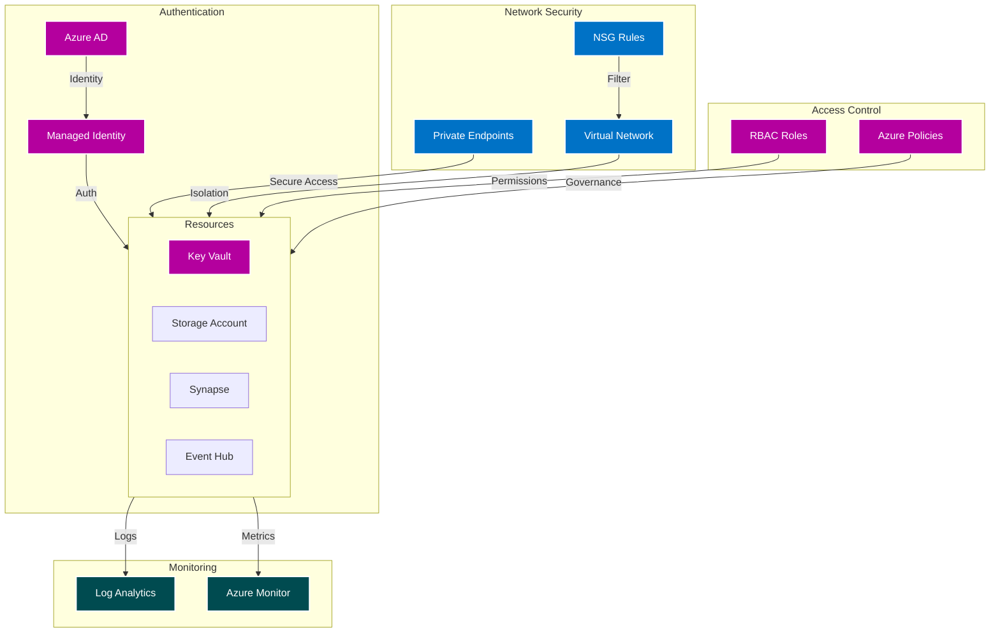

## Integration Patterns

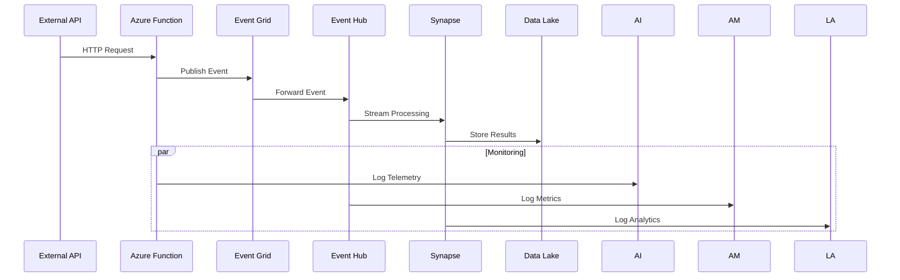

## Network Topology

```mermaid
graph TB
    subgraph Hub VNet
        FW[Azure Firewall]
        BAST[Azure Bastion]
        DNS[DNS Forwarder]
    end

    subgraph Spoke VNet
        subgraph Integration Subnet
            AF[Functions]
            LA[Logic Apps]
        end
        
        subgraph Data Subnet
            SYN[Synapse]
            SHIR[Self-hosted IR]
        end
        
        subgraph Private Endpoint Subnet
            PE1[Storage PE]
            PE2[KeyVault PE]
            PE3[EventHub PE]
        end
    end

    subgraph Security
        NSG1[Integration NSG]
        NSG2[Data NSG]
        NSG3[PE NSG]
    end

    Hub VNet ---|Peering| Spoke VNet
    NSG1 --> Integration Subnet
    NSG2 --> Data Subnet
    NSG3 --> Private Endpoint Subnet

    classDef network fill:#0072C6,stroke:#fff,stroke-width:2px,color:#fff
    classDef security fill:#B4009E,stroke:#fff,stroke-width:2px,color:#fff
    classDef compute fill:#004B50,stroke:#fff,stroke-width:2px,color:#fff

    class FW,BAST,DNS,PE1,PE2,PE3 network
    class NSG1,NSG2,NSG3 security
    class AF,LA,SYN,SHIR compute
```

## Event Processing Flow

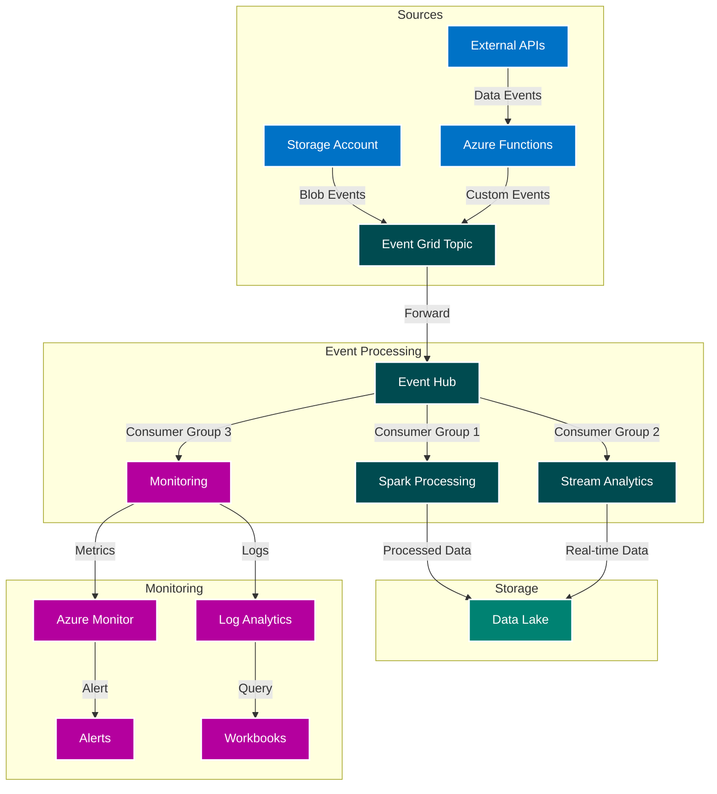

## Component-Specific Architectures

### Synapse Analytics Architecture

```mermaid
graph TB
    subgraph Data Sources
        DL[(Data Lake)] --> |Raw Data| SYN
        EH[Event Hub] --> |Streaming| SYN
        DB[(External DB)] --> |SHIR| SYN
    end

    subgraph Synapse Analytics
        subgraph Compute Resources
            SP[Spark Pools] --> |Process| DW
            SS[Serverless SQL] --> |Query| DW
            DW[Dedicated SQL Pool] --> |Serve| META[Metadata]
        end

        subgraph Integration
            SHIR[Self-hosted IR] --> |Load| STG[Staging]
            STG --> |Transform| DW
        end

        subgraph Security
            PE[Private Endpoints] --> |Secure Access| Compute Resources
            MI[Managed Identity] --> |Auth| PE
        end

        subgraph Monitoring
            METRICS[Metrics] --> MON
            LOGS[Logs] --> MON
            MON[Monitoring] --> |Alert| ALT[Alerts]
        end
    end

    subgraph Data Consumption
        DW --> |Serve| PWR[Power BI]
        DW --> |API| APIM[API Management]
        META --> |Lineage| PUR[Purview]
    end

    classDef source fill:#0072C6,stroke:#fff,stroke-width:2px,color:#fff
    classDef compute fill:#004B50,stroke:#fff,stroke-width:2px,color:#fff
    classDef security fill:#B4009E,stroke:#fff,stroke-width:2px,color:#fff
    classDef monitoring fill:#008272,stroke:#fff,stroke-width:2px,color:#fff

    class DL,EH,DB source
    class SP,SS,DW,STG compute
    class PE,MI security
    class METRICS,LOGS,MON,ALT monitoring
```

### Event Processing Architecture

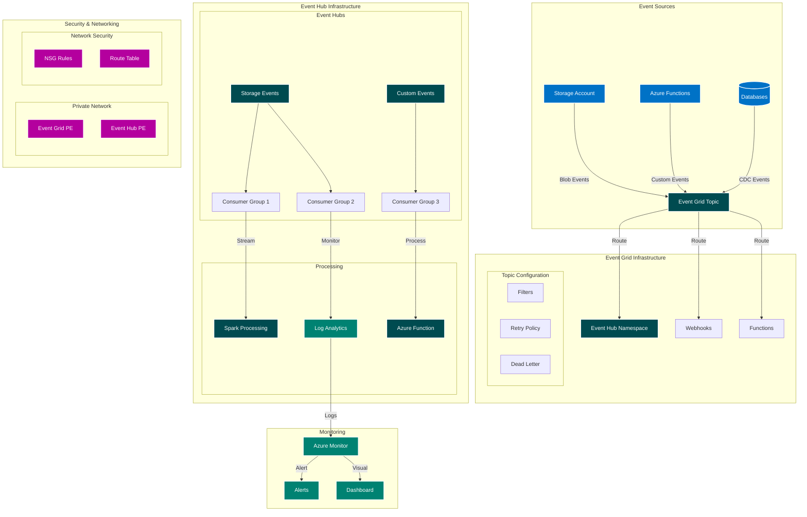

### Storage Architecture

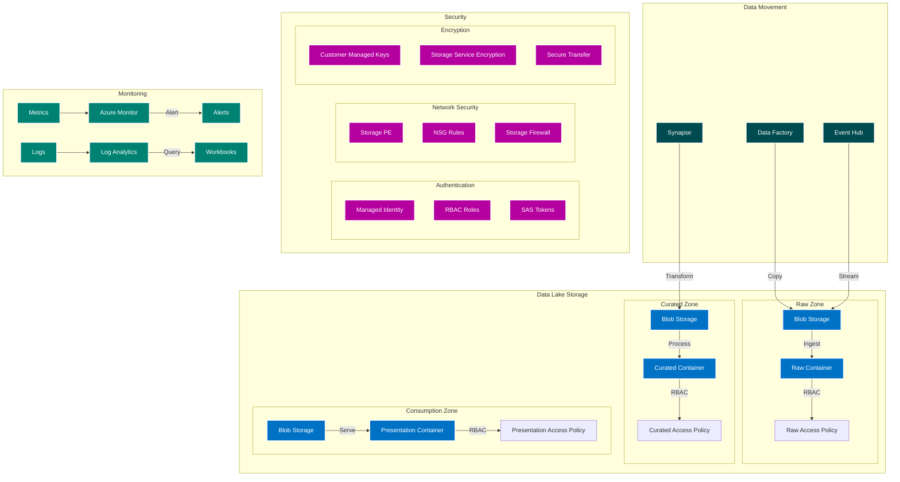

### API Management Architecture

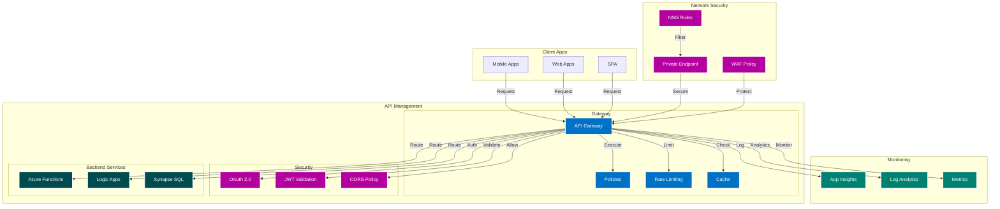

## Capacity Planning & Scaling

### Compute Resource Scaling

```mermaid
graph TB
    subgraph Synapse Spark Pools
        direction TB
        subgraph Small Pool Configuration
            SS[Small Pool] --> |3-12 nodes| SN[Node Size: Small]
            SN --> |Auto-scale| ST[Timeout: 15min]
        end
        
        subgraph Medium Pool Configuration
            MS[Medium Pool] --> |5-20 nodes| MN[Node Size: Medium]
            MN --> |Auto-scale| MT[Timeout: 30min]
        end
        
        subgraph Large Pool Configuration
            LS[Large Pool] --> |10-40 nodes| LN[Node Size: Large]
            LN --> |Auto-scale| LT[Timeout: 60min]
        end
    end

    subgraph Azure Functions
        direction TB
        subgraph Consumption Plan
            CP[Consumption] --> |Auto-scale| CI[Instances: 0-200]
            CI --> |Timeout| CT[Timeout: 5min]
        end
        
        subgraph Premium Plan
            PP[Premium] --> |Pre-warmed| PI[Instances: 1-20]
            PI --> |Scale| PT[Rules: CPU/Memory]
        end
    end

    subgraph Event Processing
        direction TB
        subgraph Event Hub Standard
            EHS[Standard] --> |TU: 1-20| EHSS[Auto-inflate]
            EHSS --> |Partitions| EHSP[Count: 4]
        end
        
        subgraph Event Hub Premium
            EHP[Premium] --> |TU: 1-40| EHPS[Zone Redundant]
            EHPS --> |Partitions| EHPP[Count: 8]
        end
    end

    classDef small fill:#0072C6,stroke:#fff,stroke-width:2px,color:#fff
    classDef medium fill:#004B50,stroke:#fff,stroke-width:2px,color:#fff
    classDef large fill:#B4009E,stroke:#fff,stroke-width:2px,color:#fff

    class SS,SN,ST small
    class MS,MN,MT medium
    class LS,LN,LT large
```

### Storage Capacity Planning

```mermaid
graph TB
    subgraph Data Lake Storage
        direction TB
        subgraph Raw Zone Capacity
            RZ[Raw Zone] --> |Initial| RZI[500 TB]
            RZI --> |Growth| RZG[20% Annual]
        end
        
        subgraph Curated Zone Capacity
            CZ[Curated Zone] --> |Initial| CZI[200 TB]
            CZI --> |Growth| CZG[30% Annual]
        end
        
        subgraph Consumption Zone Capacity
            PZ[Consumption Zone] --> |Initial| PZI[100 TB]
            PZI --> |Growth| PZG[40% Annual]
        end
    end

    subgraph Performance Tiers
        direction TB
        subgraph Hot Tier
            HT[Hot Storage] --> |IOPS| HTI[Up to 20k]
            HTI --> |Latency| HTL[<10ms]
        end
        
        subgraph Cool Tier
            CT[Cool Storage] --> |Access| CTI[Infrequent]
            CTI --> |Latency| CTL[<60ms]
        end
        
        subgraph Archive Tier
            AT[Archive] --> |Access| ATI[Rare]
            ATI --> |Latency| ATL[Hours]
        end
    end

    subgraph Throughput Scaling
        direction TB
        subgraph Standard
            STD[Standard] --> |IOPS| STDI[5000]
            STDI --> |Throughput| STDT[50 MB/s]
        end
        
        subgraph Premium
            PRE[Premium] --> |IOPS| PREI[20000]
            PREI --> |Throughput| PRET[200 MB/s]
        end
    end

    classDef hot fill:#0072C6,stroke:#fff,stroke-width:2px,color:#fff
    classDef cool fill:#004B50,stroke:#fff,stroke-width:2px,color:#fff
    classDef archive fill:#B4009E,stroke:#fff,stroke-width:2px,color:#fff

    class HT,HTI,HTL hot
    class CT,CTI,CTL cool
    class AT,ATI,ATL archive
```

### Cost Optimization Patterns

```mermaid
graph TB
    subgraph Compute Cost Optimization
        direction TB
        subgraph Auto-scaling Rules
            AR[Auto-scale] --> |CPU| CPU[>70% Scale Out]
            AR --> |Memory| MEM[>80% Scale Out]
            AR --> |Queue| QUE[>100 Messages]
        end
        
        subgraph Scale Down Rules
            SD[Scale Down] --> |CPU| CPUD[<30% Scale In]
            SD --> |Memory| MEMD[<40% Scale In]
            SD --> |Queue| QUED[<10 Messages]
        end
    end

    subgraph Storage Cost Optimization
        direction TB
        subgraph Lifecycle Management
            LM[Lifecycle] --> |Hot| H90[90 Days]
            LM --> |Cool| C180[180 Days]
            LM --> |Archive| A365[365 Days]
        end
        
        subgraph Compression
            CP[Compression] --> |Raw| CPR[No Compression]
            CP --> |Curated| CPC[Column Compression]
            CP --> |Archive| CPA[Row Compression]
        end
    end

    subgraph Reserved Capacity
        direction TB
        subgraph Commitment Levels
            CL[Reserved] --> |1 Year| Y1[10-15% Savings]
            CL --> |3 Years| Y3[20-25% Savings]
        end
        
        subgraph Resource Types
            RT[Resources] --> |Storage| RTS[Reserved TB]
            RT --> |Compute| RTC[Reserved vCores]
        end
    end

    classDef scaling fill:#0072C6,stroke:#fff,stroke-width:2px,color:#fff
    classDef storage fill:#004B50,stroke:#fff,stroke-width:2px,color:#fff
    classDef reserved fill:#B4009E,stroke:#fff,stroke-width:2px,color:#fff

    class AR,CPU,MEM,QUE scaling
    class LM,H90,C180,A365 storage
    class CL,Y1,Y3 reserved
```

### Workload-Based Scaling Scenarios

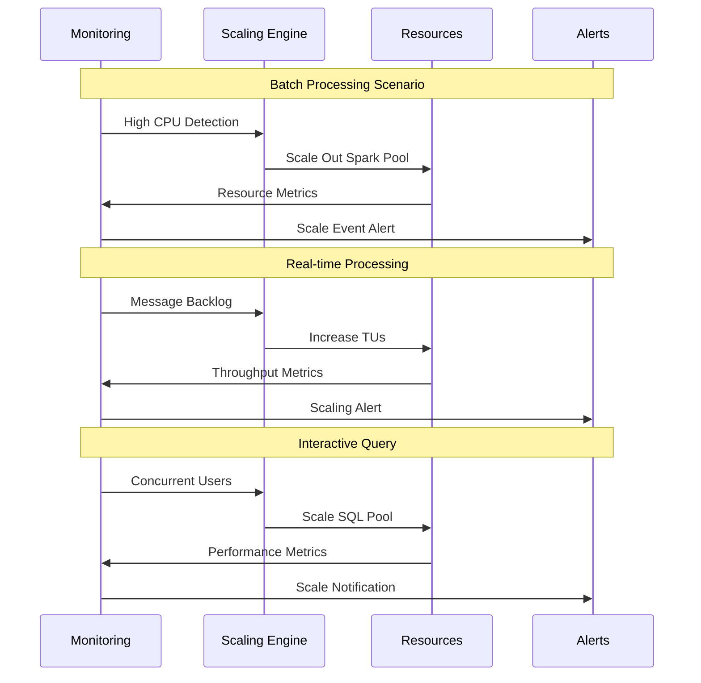

### Environment-Based Scaling Matrix

```mermaid
graph TB
    subgraph Development
        direction TB
        subgraph Dev Compute
            DC[Compute] --> |Spark| DS[Small Pool]
            DC --> |SQL| DSQ[On-demand]
        end
        
        subgraph Dev Storage
            DST[Storage] --> |ADLS| DSA[Standard]
            DST --> |Backup| DSB[LRS]
        end
    end

    subgraph Testing
        direction TB
        subgraph Test Compute
            TC[Compute] --> |Spark| TS[Medium Pool]
            TC --> |SQL| TSQ[Standard]
        end
        
        subgraph Test Storage
            TST[Storage] --> |ADLS| TSA[Standard]
            TST --> |Backup| TSB[ZRS]
        end
    end

    subgraph Production
        direction TB
        subgraph Prod Compute
            PC[Compute] --> |Spark| PS[Large Pool]
            PC --> |SQL| PSQ[Premium]
        end
        
        subgraph Prod Storage
            PST[Storage] --> |ADLS| PSA[Premium]
            PST --> |Backup| PSB[GRS]
        end
    end

    classDef dev fill:#0072C6,stroke:#fff,stroke-width:2px,color:#fff
    classDef test fill:#004B50,stroke:#fff,stroke-width:2px,color:#fff
    classDef prod fill:#B4009E,stroke:#fff,stroke-width:2px,color:#fff

    class DC,DS,DSQ,DST,DSA,DSB dev
    class TC,TS,TSQ,TST,TSA,TSB test
    class PC,PS,PSQ,PST,PSA,PSB prod
```