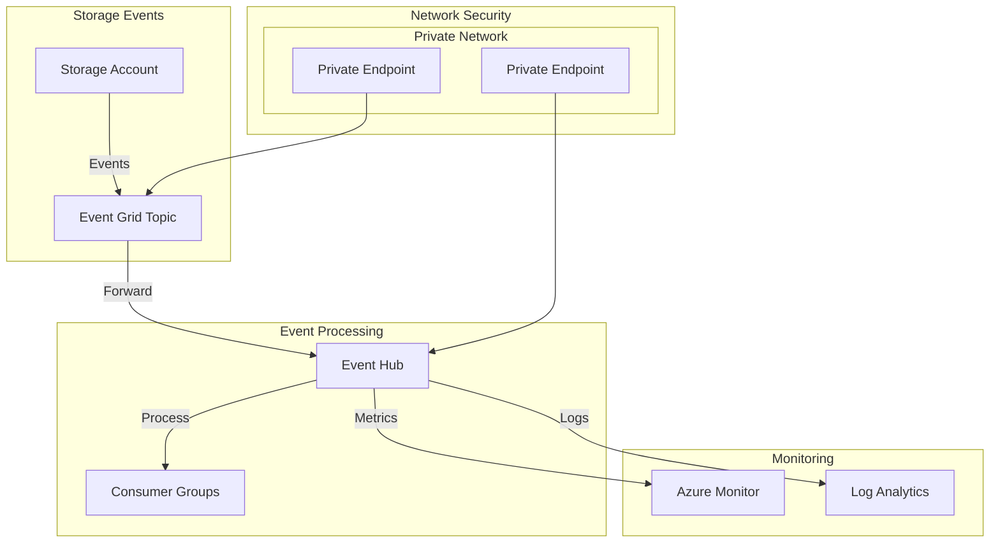

# Event Infrastructure Documentation

## Overview
The event infrastructure in the GPT Data Platform combines Azure Event Grid and Event Hub to provide a robust, scalable event processing solution. This infrastructure enables real-time monitoring of storage events, supports event-driven architectures, and facilitates data integration scenarios.

## Key Components

### Azure Event Grid Topic
- **Purpose**: Collects and routes storage events
- **Features**:
  - Private network access only
  - EventGridSchema for message format
  - Comprehensive storage event filtering
  - Integration with Event Hub destination
- **Security**:
  - Azure AD authentication
  - Private endpoints
  - Network isolation

### Azure Event Hub
- **Purpose**: Event processing and retention
- **Environment-Specific Configurations**:
  - Development:
    - Standard SKU
    - 1 throughput unit
    - Basic monitoring
  - SIT:
    - Standard SKU
    - 2 throughput units
    - Enhanced monitoring
  - Production:
    - Premium SKU
    - 4 throughput units
    - Zone redundancy
    - Advanced monitoring
- **Features**:
  - Auto-inflate enabled
  - Private network access
  - 7-day message retention
  - Dedicated consumer groups

## Architecture



## Components

### Azure Event Hub Namespace

The Event Hub Namespace hosts the event processing infrastructure with the following configurations:

- **SKU Tiers**:
  - Development: Standard SKU, 1 throughput unit
  - SIT: Standard SKU, 2 throughput units
  - Production: Premium SKU, 4 throughput units, zone redundant

- **Features**:
  - Auto-inflate enabled (up to 20 units)
  - Private network access only
  - 7-day message retention
  - Dedicated consumer group for monitoring

### Azure Event Grid Topic

Event Grid Topic handles the ingestion of storage events with:
- Private network access only
- EventGridSchema input schema
- Integration with Event Hub destination
- Comprehensive storage event filtering

### Network Security

All components use private endpoints with:
- Private DNS zone integration
- No public network access
- Subnet-level access control

## Deployment

### Prerequisites

1. Azure subscription with required permissions
2. Existing Virtual Network with appropriate subnets
3. Private DNS zones for Event Hub and Event Grid
4. Storage account configured for event generation

### Environment-Specific Parameters

Parameters are provided for three environments:
- Development (dev.eventing.parameters.json)
- System Integration Testing (sit.eventing.parameters.json)
- Production (prod.eventing.parameters.json)

### Deployment Process

1. Deploy base infrastructure (networking, DNS zones)
2. Deploy Event Hub and Event Grid resources
3. Configure private endpoints
4. Set up Event Grid subscription to Event Hub
5. Validate connectivity and event flow

## Monitoring

The infrastructure includes:
- Dedicated consumer group for monitoring applications
- Azure Monitor integration
- Custom workbook for event visualization
- Metric alerts for throughput and latency

## Event Types

The following storage events are monitored:
- Microsoft.Storage.BlobCreated
- Microsoft.Storage.BlobDeleted
- Microsoft.Storage.BlobRenamed
- Microsoft.Storage.DirectoryCreated
- Microsoft.Storage.DirectoryDeleted
- Microsoft.Storage.DirectoryRenamed

## Security Considerations

1. **Network Security**:
   - All components use private endpoints
   - No public network access
   - Subnet-level access control

2. **Authentication**:
   - Azure AD integration
   - Managed identities for cross-resource access
   - SAS tokens for external integrations

3. **Data Protection**:
   - Transport layer encryption
   - At-rest encryption
   - Secure event schema validation

## Maintenance and Operations

### Regular Maintenance Tasks

1. Monitor throughput units and adjust as needed
2. Review event delivery logs
3. Check private endpoint health
4. Validate event processing latency

### Troubleshooting

Common issues and resolutions:
1. Event delivery delays
   - Check network connectivity
   - Verify Event Grid subscription status
   - Monitor Event Hub throttling metrics

2. Private endpoint connectivity
   - Validate DNS resolution
   - Check NSG rules
   - Verify subnet configurations

3. Processing bottlenecks
   - Monitor throughput units
   - Check consumer group performance
   - Review partition distribution

## Integration Examples

### Monitoring Consumer

```csharp
var connectionString = "<event-hub-connection-string>";
var consumerGroup = "storage-monitoring";
var eventHubName = "storage-monitoring";

var consumer = new EventHubConsumerClient(
    consumerGroup,
    connectionString,
    eventHubName);

await foreach (PartitionEvent evt in consumer.ReadEventsAsync())
{
    // Process storage events
    Console.WriteLine($"Event: {evt.Data.EventBody}");
}
```

### Event Grid Subscription Validation

```powershell
$topicEndpoint = "<event-grid-topic-endpoint>"
$eventGridKey = "<event-grid-key>"

Test-AzEventGridConnection -TopicEndpoint $topicEndpoint -TopicKey $eventGridKey
```