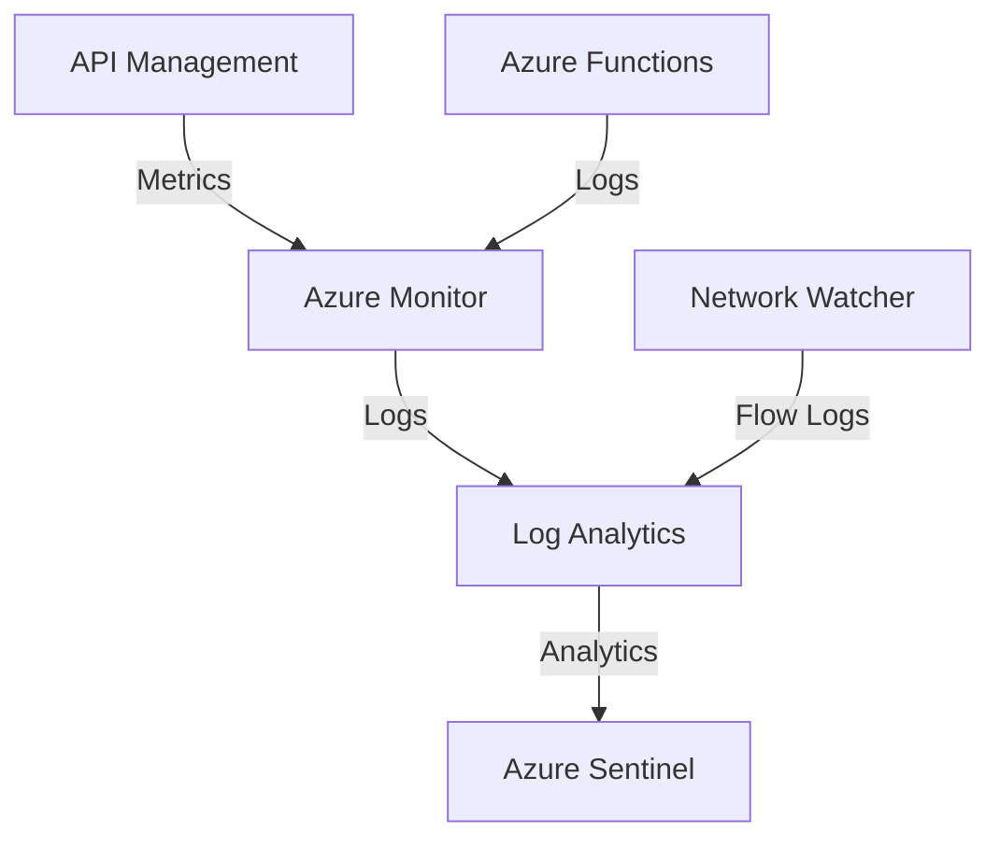

# Security Risk Assessment - GPT Data Platform

## Executive Summary

This document provides a comprehensive security assessment of the GPT Data Platform, analyzing current security controls, identifying potential risks, and providing mitigation recommendations.

## Infrastructure Components Analysis

### Network Security

#### Virtual Network Isolation
| Control | Status | Risk Level | Notes |
|---------|--------|------------|-------|
| VNET Isolation | ✅ Implemented | Low | Separate subnets for each service |
| Private Endpoints | ✅ Implemented | Low | Used for Azure services communication |
| NSG Rules | ✅ Implemented | Medium | Some required ports must remain open |
| Service Tags | ✅ Implemented | Low | Used in NSG rules |

**Risk**: Without data exfiltration policy, there's a potential for data to be transferred outside the network.
- Impact: High
- Probability: Medium
- **Mitigation**: Implement strict monitoring and alerting on outbound traffic patterns

### API Management Security

#### API Gateway Controls
| Control | Status | Risk Level | Notes |
|---------|--------|------------|-------|
| Subscription Keys | ✅ Implemented | Low | Required for all APIs |
| Rate Limiting | ✅ Implemented | Low | Prevents abuse |
| IP Filtering | ❌ Not Implemented | Medium | Could enhance security |
| OAuth2/OIDC | ❌ Not Implemented | High | Consider for user authentication |

**Risk**: Public internet exposure of APIs
- Impact: High
- Probability: Medium
- **Mitigation**: Consider implementing IP allowlisting for sensitive endpoints

### Azure Functions Security

#### Function App Controls
| Control | Status | Risk Level | Notes |
|---------|--------|------------|-------|
| VNET Integration | ✅ Implemented | Low | Functions run in VNET |
| Managed Identity | ✅ Implemented | Low | No credentials in code |
| HTTPS Only | ✅ Implemented | Low | Enforced by default |
| Runtime Version | ✅ Implemented | Low | Using .NET 8 isolated worker |

**Risk**: Function code execution vulnerabilities
- Impact: High

### Azure Kubernetes Service (AKS) Security

#### Container Orchestration Controls
| Control | Status | Risk Level | Notes |
|---------|--------|------------|-------|
| RBAC Enabled | ✅ Implemented | Low | Kubernetes RBAC active |
| Private Cluster | ✅ Implemented | Low | API server not publicly accessible |
| Network Policies | ✅ Implemented | Medium | Pod-to-pod communication controlled |
| Container Registry | ✅ Implemented | Low | Private ACR integration |
| Pod Security Standards | ✅ Implemented | Medium | Baseline security policies |

**Risk**: Container escape or privilege escalation
- Impact: High
- Probability: Low
- **Mitigation**: Regular security scanning and policy enforcement

### Azure Machine Learning Security

#### ML Platform Controls
| Control | Status | Risk Level | Notes |
|---------|--------|------------|-------|
| VNET Integration | ✅ Implemented | Low | Compute isolated in VNET |
| Private Endpoints | ✅ Implemented | Low | All ML services private |
| Model Encryption | ✅ Implemented | Low | Models encrypted at rest |
| Data Lineage | ✅ Implemented | Medium | Via Purview integration |

**Risk**: Model theft or data poisoning
- Impact: High
- Probability: Medium
- **Mitigation**: Access controls and audit logging

### Microsoft Purview Security

#### Data Governance Controls
| Control | Status | Risk Level | Notes |
|---------|--------|------------|-------|
| Private Endpoints | ✅ Implemented | Low | Portal and APIs private |
| Data Classification | ✅ Implemented | Medium | Automated sensitivity labeling |
| Access Policies | ✅ Implemented | Low | Role-based data access |
| Audit Logging | ✅ Implemented | Low | All access logged |

**Risk**: Unauthorized data discovery or classification bypass
- Impact: Medium

### Microsoft Fabric Security

#### Analytics Platform Controls
| Control | Status | Risk Level | Notes |
|---------|--------|------------|-------|
| Capacity Isolation | ✅ Implemented | Low | Dedicated capacity |
| OneLake Security | ✅ Implemented | Medium | Lake-level permissions |
| Workspace RBAC | ✅ Implemented | Low | Role-based workspace access |
| Data Lineage | ✅ Implemented | Medium | End-to-end tracking |

**Risk**: Data exposure through Fabric sharing
- Impact: High

### Container Instances Security

#### Lightweight Container Controls
| Control | Status | Risk Level | Notes |
|---------|--------|------------|-------|
| VNET Integration | ✅ Implemented | Low | Containers run in VNET |
| Managed Identity | ✅ Implemented | Low | No stored credentials |
| Resource Limits | ✅ Implemented | Medium | CPU/Memory constraints |
| Image Security | ✅ Implemented | Medium | Base image scanning |

**Risk**: Resource exhaustion or container breakout
- Impact: Medium
- Probability: Low
- **Mitigation**: Regular code reviews, dependency scanning

### Data Security

#### Storage Controls
| Control | Status | Risk Level | Notes |
|---------|--------|------------|-------|
| Encryption at Rest | ✅ Implemented | Low | Azure-managed keys |
| Encryption in Transit | ✅ Implemented | Low | TLS 1.2 enforced |
| Private Endpoints | ✅ Implemented | Low | No public access |
| Shared Access Signatures | ❓ Unknown | Medium | Review implementation |

**Risk**: Data exfiltration through legitimate API calls
- Impact: High
- Probability: Medium
- **Mitigation**: Implement data classification and monitoring

## High-Priority Security Gaps

1. Authentication and Authorization
   - **Gap**: No OAuth2/OIDC implementation
   - **Risk Level**: High
   - **Recommendation**: Implement Azure AD integration for user authentication

2. Monitoring and Detection
   - **Gap**: Limited monitoring of data access patterns
   - **Risk Level**: High
   - **Recommendation**: Implement Azure Sentinel or similar SIEM solution

3. API Security
   - **Gap**: No API schema validation
   - **Risk Level**: Medium
   - **Recommendation**: Implement strict schema validation in APIM policies

## Compliance Status

### Implemented Controls
- ✅ Network Segmentation
- ✅ Encryption in Transit
- ✅ Encryption at Rest
- ✅ Access Control (Basic)
- ✅ Audit Logging

### Missing Controls
- ❌ Data Loss Prevention
- ❌ Advanced Threat Protection
- ❌ SIEM Integration
- ❌ Security Information and Event Management

## Risk Matrix

| Risk Area | Likelihood | Impact | Overall Risk |
|-----------|------------|--------|--------------|
| Data Exfiltration | High | High | High |
| Unauthorized Access | Medium | High | High |
| DoS Attacks | Low | Medium | Medium |
| Code Injection | Low | High | Medium |
| Network Breach | Low | High | Medium |

## Security Recommendations

### Immediate Actions (0-30 days)
1. Implement Azure AD integration for API authentication
2. Enable advanced monitoring and alerting
3. Configure IP allowlisting for management endpoints
4. Implement request rate limiting per user/IP

### Short-term (30-90 days)
1. Deploy Azure Sentinel for SIEM capabilities
2. Implement automated vulnerability scanning
3. Enhance logging and monitoring coverage
4. Develop incident response procedures

### Long-term (90+ days)
1. Implement full Zero Trust architecture
2. Enhance data classification and governance
3. Regular penetration testing program
4. Security awareness training program

## Compensating Controls for Data Exfiltration Risk

Since data exfiltration policy cannot be enabled, implement these compensating controls:

1. Enhanced Monitoring
```json
{
    "monitoring": {
        "dataAccessPatterns": true,
        "volumeBasedAlerts": true,
        "anomalyDetection": true,
        "realTimeAlerts": true
    }
}
```

2. API Rate Limiting Policy
```xml
<policies>
    <inbound>
        <rate-limit calls="100" renewal-period="60" />
        <quota calls="10000" renewal-period="3600" />
        <ip-filter action="allow">
            <address-range from="xxx.xxx.xxx.xxx" to="xxx.xxx.xxx.xxx" />
        </ip-filter>
    </inbound>
</policies>
```

3. Data Access Logging
```json
{
    "logging": {
        "level": "Verbose",
        "categories": [
            "DataAccess",
            "Authorization",
            "ApiCalls"
        ],
        "retention": "90days"
    }
}
```

## Regular Security Review Process

1. Weekly
- Review security logs
- Monitor usage patterns
- Check for policy violations

2. Monthly
- Full security metrics review
- Update access controls
- Vulnerability assessment

3. Quarterly
- Complete security audit
- Update security documentation
- Review and update policies

## Incident Response Plan

1. Detection
- Automated alerts
- Manual monitoring
- User reports

2. Analysis
- Impact assessment
- Scope determination
- Root cause analysis

3. Containment
- Immediate actions
- Service isolation
- Access restriction

4. Recovery
- Service restoration
- Data verification
- Control validation

## Appendix

### Security Tools and Integration Points


### Security Metrics Dashboard
- API Usage Patterns
- Authentication Failures
- Rate Limit Violations
- Data Access Volumes
- Network Flow Analysis

### Configuration Baselines
- NSG Rules
- API Policies
- Authentication Settings
- Monitoring Rules